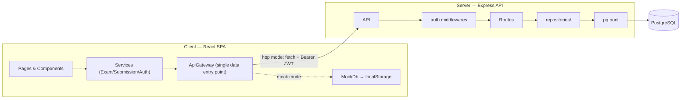
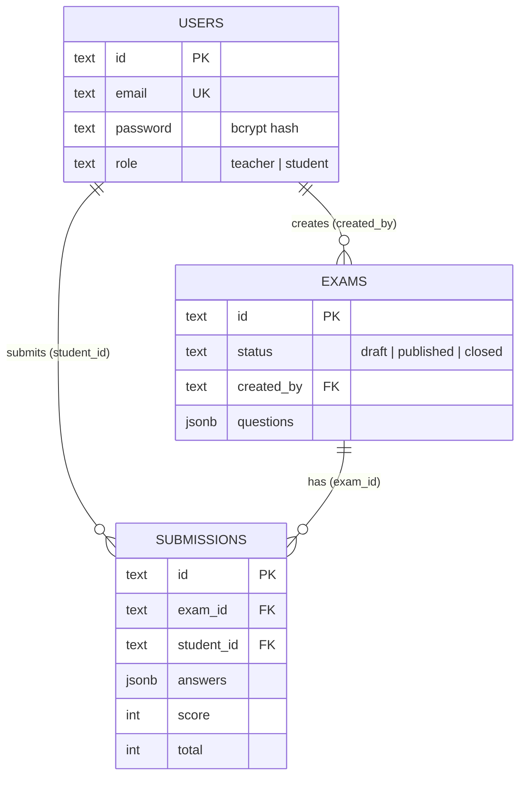
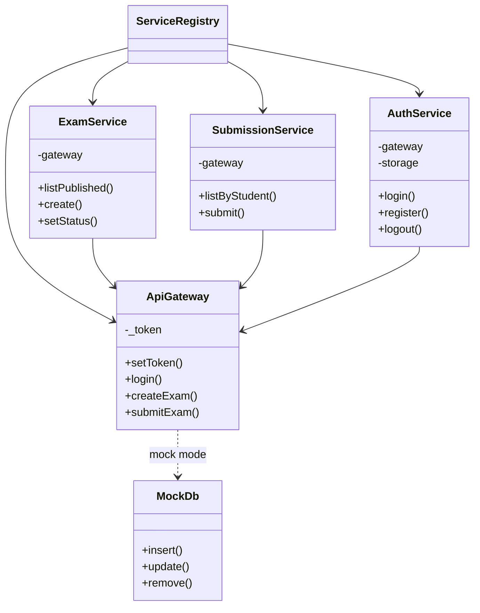
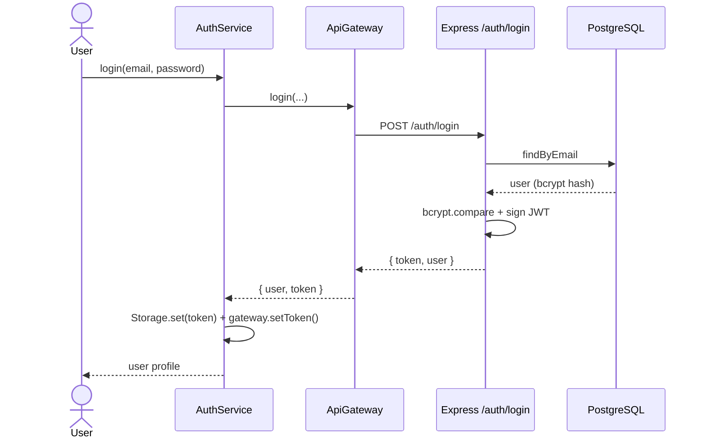
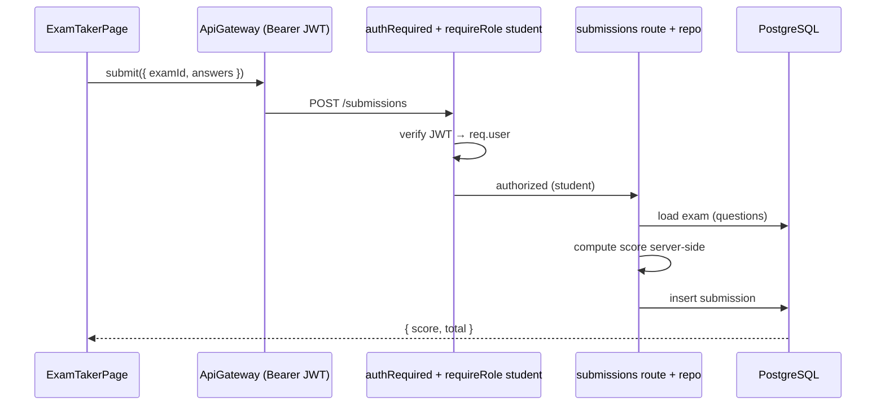
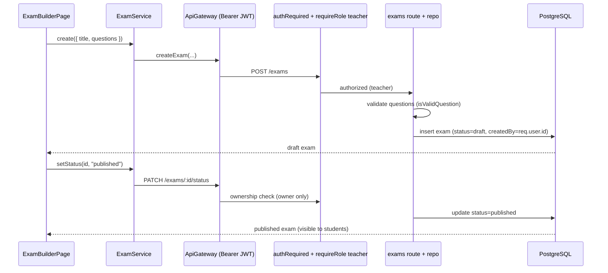

# ExamApp — Project Submission

Online exam management system (Hebrew / RTL UI). Teachers create and publish exams; students take them and receive **server-side auto-graded** results. Full stack: **React 19 (Vite) SPA + Express API + PostgreSQL**, with JWT authentication and role/ownership authorization.

This document follows the submission checklist. Each section links to the detailed docs in [`docs/`](docs/README.md) and [`client/docs/`](client/docs/README.md).

---

## 1. Documentation

| Doc | Contents |
|-----|----------|
| [README.md](README.md) | Overview, live links, setup, scripts |
| [CLAUDE.md](CLAUDE.md) | Architecture & conventions (contributor guide) |
| [docs/architecture.md](docs/architecture.md) | System architecture, service graph, request lifecycle, deployment |
| [docs/database.md](docs/database.md) | Schema, ER diagram, JSON models |
| [docs/use-cases.md](docs/use-cases.md) | Actors, use cases, flows |
| [client/docs/](client/docs/README.md) | Frontend deep-dive: components, services (UML), data model |
| [backend/db/README.md](backend/db/README.md) · [DOCKER.md](backend/db/DOCKER.md) | Database layer & local Docker DB |

## 2. Links

- **GitHub:** https://github.com/Shadi-Abu-Jaber/ExamApp
- **App (frontend):** https://examapp-1-wfnn.onrender.com
- **API (backend):** https://examapp-x6bh.onrender.com
- **Demo logins:** `teacher@demo.test` / `teacher123` · `student@demo.test` / `student123`

> The API runs on Render's free tier and sleeps when idle — the first request after inactivity may take ~50s to wake.

## 3. Main features, pages & API

### Features
- **Teacher:** create / edit / publish / close / delete exams; author single-answer multiple-choice questions (2–6 options); dashboard with exam counts by status.
- **Student:** browse published exams; take an exam and submit; **automatic server-side grading**; view grades (score / % / pass-fail) and a dashboard (available / submitted / average).
- **Platform:** JWT auth (bcrypt-hashed passwords); server-side role + ownership authorization; responsive Bootstrap 5 UI.

### Pages (React Router, hash-based)
| Route | Page | Role |
|-------|------|------|
| `/` | HomePage | any |
| `/login`, `/register` | LoginPage, RegisterPage | guest |
| `/teacher` | TeacherDashboard | teacher |
| `/teacher/exams` | MyExamsPage (list + status actions) | teacher |
| `/teacher/exams/new`, `/teacher/exams/:id/edit` | ExamBuilderPage / ExamEditorPage (ExamForm + QuestionEditor) | teacher |
| `/student` | StudentDashboard | student |
| `/student/exams` | AvailableExamsPage | student |
| `/student/exams/:id/take` | ExamTakerPage | student |
| `/student/results` | ResultsPage | student |

### API endpoints
| Method & path | Auth | Purpose |
|---------------|------|---------|
| `POST /auth/login`, `POST /auth/register` | public | Returns `{ token, user }` |
| `GET /exams`, `GET /exams/:id` | authed | List / get exams (filter by `status`, `teacherId`) |
| `POST /exams` | teacher | Create (owner = JWT user) |
| `PUT /exams/:id` | teacher + owner | Update |
| `PATCH /exams/:id/status` | teacher + owner | draft ↔ published ↔ closed |
| `DELETE /exams/:id` | teacher + owner | Delete |
| `GET /submissions` | student (own) / teacher (owned exam) | List submissions |
| `POST /submissions` | student | Submit answers → server computes score |
| `GET /users`, `GET /users/:id` | authed | Public profiles (no password) |

## 4. Overall architecture (top-down: Client → Server → DB → Services)



- **Who talks to whom:** UI → Services → **ApiGateway** (the only component that knows mock vs. HTTP) → Express routes → repositories → `pg` pool → PostgreSQL. Responses flow back the same path.
- **Where users are stored:** in the `users` table in PostgreSQL (http mode) with **bcrypt-hashed** passwords; in mock mode, in `localStorage`. The signed-in user's public profile is kept in `localStorage` (`examapp::current_user`), and the JWT in `examapp::auth_token`.
- **Who stores what / how DATA flows:** exams and submissions live in PostgreSQL (`exams`, `submissions`); questions and answers are stored as **JSONB** inside those rows. The server is **authoritative** — `createdBy` / `studentId` come from the JWT (not the request body) and **exam scores are computed on the server**, so the client cannot be trusted to grade.

Full detail + request-lifecycle diagrams: [docs/architecture.md](docs/architecture.md).

## 5. Client & Server architecture (separately)

### Client — layered, service-oriented + component-based
Roughly maps to MVC: **Models** = `src/models` (ES6 classes with domain rules), **Views** = `src/components` + `src/pages`, **Controller/logic** = the OOP service layer + `ApiGateway`. A singleton **service graph** is built by `ServiceRegistry` (dependency injection) and reached via React contexts (`useServices`, `useAuth`).

- **Packages:** `react`, `react-dom`, `react-router-dom`; dev: `vite`, `eslint` (+ react plugins). Bootstrap 5 via CDN.
- **Component hierarchy & UML:** [client/docs/components.md](client/docs/components.md), [client/docs/services.md](client/docs/services.md).

### Server — layered (routes → repositories → db)
`routes/` validate + authorize (controllers) → `repositories/` hold **all SQL** (data access) → `db.js` `pg` pool. Cross-cutting `middlewares/` (`authRequired`, `requireRole`, `errorHandler`) and `auth/` (`tokens.js` JWT, `password.js` bcrypt).

- **Packages:** `express`, `cors`, `dotenv`, `pg`, `bcryptjs`, `jsonwebtoken`; dev: `nodemon`.
- **Install:** `cd backend && npm install` · `cd client && npm install` (or `npm run install:all` from the root).

## 6. Database — ERD & JSON models



Hybrid **relational + JSONB**: `exams.questions` and `submissions.answers` are JSONB.

```jsonc
// exams.questions[]                     // submissions.answers[]
{ "id": "q1", "text": "…",              [0, 2, 1]   // chosen option index per question
  "options": ["…","…"], "correctAnswer": 0 }
```

Details, constraints & indexes: [docs/database.md](docs/database.md).

## 7. OOP UML (client class diagram)



Full class members (services, models, enums): [client/docs/services.md](client/docs/services.md).

## 8. Key scenarios (sequence diagrams)

### Scenario A — Login (auth + JWT)


### Scenario B — Student takes & submits an exam (server grading)


### Scenario C — Teacher creates & publishes an exam


## 9. Milestones & branch structure

**Branch model:** `main` (release — auto-deploys to Render) ← PRs from `dev` (integration) ← short-lived `feature/*`, `fixbug/*`, `chore/*`, `docs/*` branches. ~38 pull requests over the semester.

| Phase | Milestone | Branch(es) |
|-------|-----------|-----------|
| Foundation | Spec, React init, joint foundation, early login/AI experiments | `feature/1-specfile`, `feature/3-initreact`, `feature/joint-full-examflow-foundation` |
| P1 · M1 | OOP services, models, router shell | `feature/m1-services-scaffolding` |
| P1 · M2 | Auth (login/register) + role-aware protected routes | `feature/m2-auth` |
| P1 · M3 | Teacher pages — exam CRUD + status transitions | `feature/m3-teacher` |
| P1 · M4 | Student pages — browse, take, results | `feature/m4-student` |
| P1 · M5 | Diagrams + documentation | `feature/m5-diagrams` |
| P3 · M1 | Express server (in-memory JSON) | `feature/p3-m1-server` |
| P3 · M2 | `ApiGateway` + mock/http mode toggle | `feature/p3-m2-client-gateway` |
| P3 · M3 | VS Code tasks + debug launchers | `feature/p3-m3-debug` |
| DB | Hybrid PostgreSQL schema + seed + Docker | `feature/docker-postgres` |
| Final | PostgreSQL + JWT integration, Render deploy, docs | `dev` → `main` |

Fixes and chores followed the same flow (e.g. `fixbug/notify-detached-method-on-submit`, `chore/preview-launch-config`).

## 10. Work processes, configuration & deployment

- **Configuration:** environment-driven. Backend reads `DATABASE_URL` (managed PG, TLS) or discrete `PG_*` (local); plus `JWT_SECRET`, `CORS_ORIGIN`, `PORT` — see [backend/.env.example](backend/.env.example). The client's data mode is `VITE_DATA_MODE` (`mock`/`http`) + `VITE_SERVER_BASE_URL`.
- **Docker:** local PostgreSQL runs in Docker (image + compose with a named volume + healthcheck); the DB seeds itself on first start. Guide: [backend/db/DOCKER.md](backend/db/DOCKER.md).
- **Deployment (CI/CD):** Render **auto-deploys from `main`** — a static site (frontend), a web service (API), and a managed PostgreSQL. Pushing to `main` redeploys.
- **Tests:** **Vitest** unit tests in both packages (19 tests) — backend: bcrypt hashing, JWT sign/verify, id generation (`backend/tests/`); client: model rules, service delegation, `AuthService` token handling, `ApiGateway` mock/http (`client/tests/`). Run with `npm test` in each package, or `npm test` from the repo root for both. `backend/db/connect-test.js` (`npm run db:test`) is an additional DB-connectivity smoke test that also demonstrates JSONB queries.
- **Logging:** a small level-aware logger on both sides — `backend/src/logger.js` (prefixed `server:*` streams) and the client `Logger` service (with `child()` prefixes), used across services and HTTP handlers.
- **Linting:** ESLint flat config on the client (`npm run lint`).

---

*Note: UI copy and in-code comments are in Hebrew (RTL) to match the target users; all documentation is in English.*
