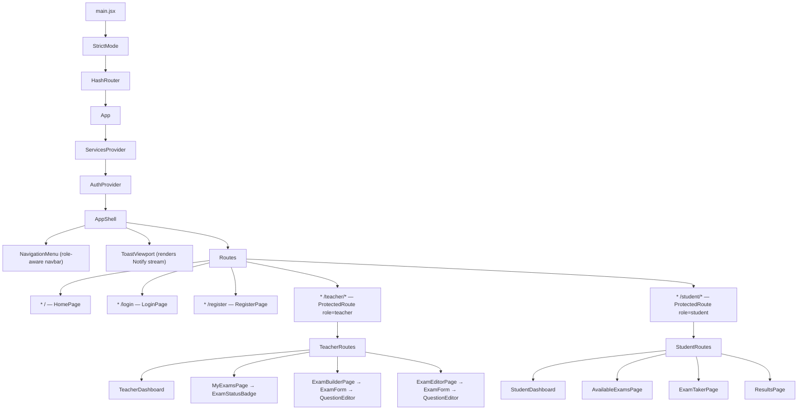

# Component hierarchy

Read top-down; `*` marks routed pages. Providers wrap the app, then pages compose shared and teacher-specific components.

Routing uses **`HashRouter`** (`main.jsx`), so paths are hash-based (`/#/login`, `/#/teacher/exams`, …).

## Cross-cutting hooks

| Hook | Purpose |
|------|---------|
| `useServices()` | Reach the OOP service graph from any component |
| `useNotifyToasts()` | Derive toast state from the `Notify` pub/sub stream |
| `useAuth()` | Current user + `login` / `register` / `logout` actions |
| `useLocation` / `useNavigate` / `useParams` | React Router primitives |
