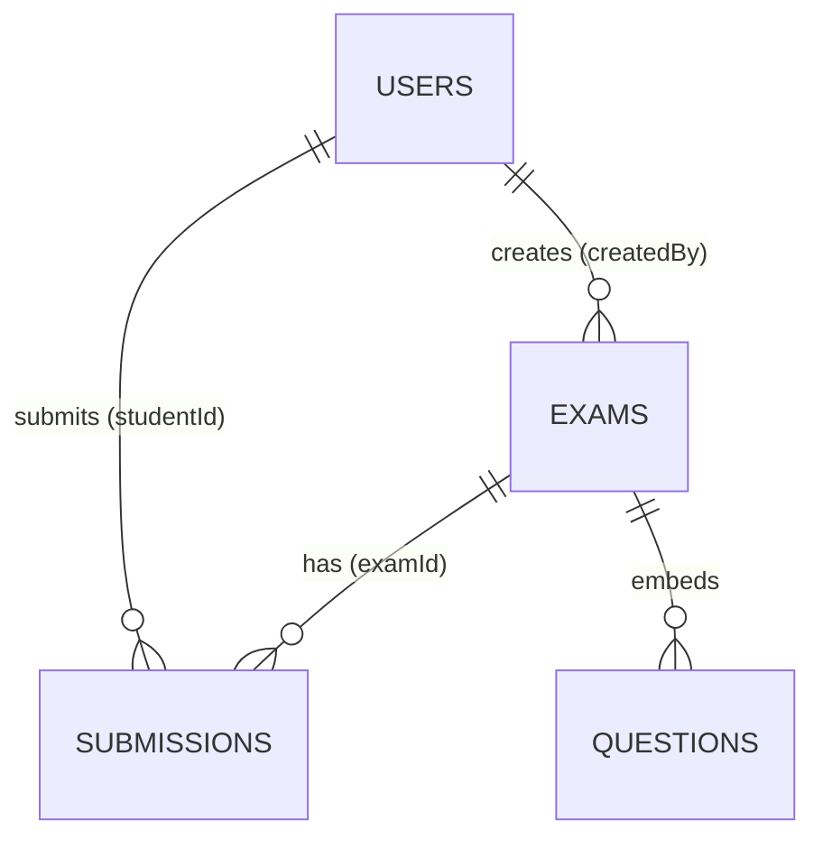

# Data model

The client's view of the data. In **mock mode** these shapes are stored in `localStorage`; in **http mode** the same shapes come from the API. For the authoritative PostgreSQL schema, see [../../docs/database.md](../../docs/database.md).

## Entities

Each row is the JSON form of the matching model class (`src/models/`).

### `users`
```js
{
  id: string,            // e.g. "user_<ts>_<rand>"
  name: string,
  email: string,         // lowercased + trimmed, unique
  password: string,      // mock: plaintext on-device only · server: bcrypt hash
  role: "teacher" | "student"
}
```

### `exams`
```js
{
  id: string,
  title: string,
  description: string,
  status: "draft" | "published" | "closed",
  questions: Question[], // embedded
  createdBy: string,     // owning teacher's user id
  createdAt: number      // epoch ms
}

// Question (embedded)
{
  id: string,
  text: string,
  options: string[],     // 2..6
  correctAnswer: number  // index into options
}
```

### `submissions`
```js
{
  id: string,
  examId: string,        // → exams.id
  studentId: string,     // → users.id
  answers: number[],     // one chosen index per question, in order
  score: number,         // count of correct answers
  total: number,         // number of questions
  submittedAt: number    // epoch ms
}
```

## Relationships



## localStorage keys

| Key | Contents |
|-----|----------|
| `examapp::mockdb` | The three tables above (mock mode) |
| `examapp::current_user` | Public profile of the signed-in user (no password) |
| `examapp::auth_token` | JWT for http mode (sent as a Bearer header) |
| `examapp::dataMode` | Optional runtime `mock` / `http` override |

Seed (mock mode): 2 demo users (`teacher@demo.test`, `student@demo.test`) and 2 exams (one published, one draft). Reset with `db.reset()` or by clearing `examapp::mockdb`.
