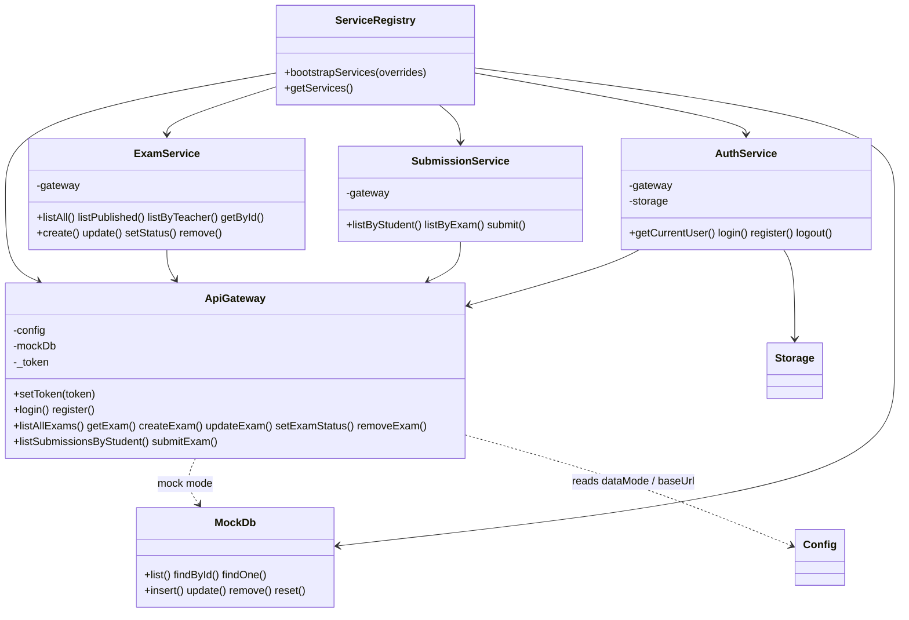

# Services & models

The client keeps UI in components and everything else (persistence, config, logging, notifications, data access) in plain ES6 classes. `ServiceRegistry` wires them into a singleton graph via constructor injection.

## Service graph

**Key point:** the domain services (`ExamService` / `SubmissionService` / `AuthService`) are thin orchestrators over **`ApiGateway`** — they never touch `MockDb` or `fetch` directly. `ApiGateway` decides, per `Config.dataMode`, whether a call hits the in-memory `MockDb` or the Express server.

### Utility services

| Service | Responsibility |
|---------|----------------|
| `Config` | App-wide config (`dataMode`, `serverBaseUrl`, app name, …); `get` / `set` / `all` |
| `Logger` | Level-aware logger with `child(prefix)` |
| `Storage` | Namespaced `localStorage` wrapper with in-memory fallback |
| `Notify` | Pub/sub for toasts (`subscribe`, `success` / `info` / `warn` / `error`) |

## Models (`src/models/`)

Plain ES6 classes for the core entities; validation and domain rules are encapsulated here.

| Model | Notable members |
|-------|-----------------|
| `User` | `role` (`USER_ROLE`), `isTeacher()`, `isStudent()`, `publicProfile()`, `toJSON()` |
| `Exam` | `status` (`EXAM_STATUS`), `questions: Question[]`, `isPublishable()`, `publish()` / `close()` / `toDraft()`, `toJSON()` |
| `Question` | `text`, `options: string[2..6]`, `correctAnswer: number`, `isValid()`, `toJSON()` |
| `Submission` | `examId`, `studentId`, `answers: number[]`, `score`, `total`, `percentage()`, `toJSON()` |

Enums: `USER_ROLE = { TEACHER:'teacher', STUDENT:'student' }`, `EXAM_STATUS = { DRAFT:'draft', PUBLISHED:'published', CLOSED:'closed' }`.

## Key flows

- `ExamService.create()` → `ApiGateway.createExam()` → **http:** `POST /exams` · **mock:** insert into `MockDb('exams')`.
- `SubmissionService.submit()` → `ApiGateway.submitExam()` → the **score is computed server-side** in http mode (in `MockDb` in mock mode).
- `AuthService.login()` → `ApiGateway.login()` → persists the user (and, in http mode, the JWT) via `Storage` and calls `gateway.setToken()`; rehydrated on reload.
