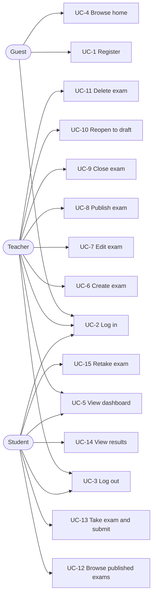

# Use cases (client view)

Actors as seen by the SPA: **Guest** (not signed in), **Teacher**, **Student**. For the canonical system-level use cases see [../../docs/use-cases.md](../../docs/use-cases.md).

## Screens per use case

| Use case | Route (hash) | Actor |
|----------|--------------|-------|
| UC-1 / UC-2 Register / Login | `/#/register`, `/#/login` | Guest |
| UC-5 Dashboard | `/#/teacher`, `/#/student` | Teacher / Student |
| UC-6 / UC-7 Create / edit exam | `/#/teacher/exams/new`, `/#/teacher/exams/:id/edit` | Teacher |
| UC-8..11 Publish / close / reopen / delete | `/#/teacher/exams` | Teacher |
| UC-12 / UC-13 Browse / take exam | `/#/student/exams`, `/#/student/exams/:id/take` | Student |
| UC-14 Results | `/#/student/results` | Student |

## Pre / post conditions (selected)

- **UC-6 Create exam** — *Pre:* teacher signed in. *Post:* exam saved with `status="draft"` and `createdBy = teacher.id`.
- **UC-8 Publish exam** — *Pre:* `Exam.isPublishable()` (non-empty title and every `Question.isValid()`). *Post:* `status="published"`, visible to students (UC-12).
- **UC-13 Take exam** — *Pre:* student signed in and exam `status="published"`. *Post:* a submission is stored with server-computed `score`/`total`; student sees a pass/fail card and the entry appears in results (UC-14).
