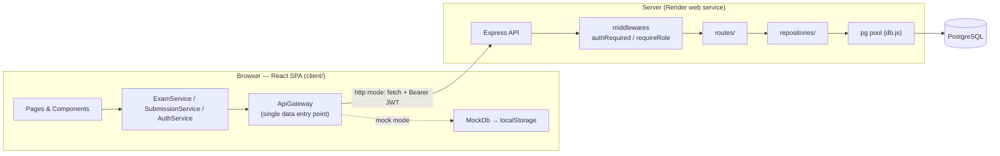
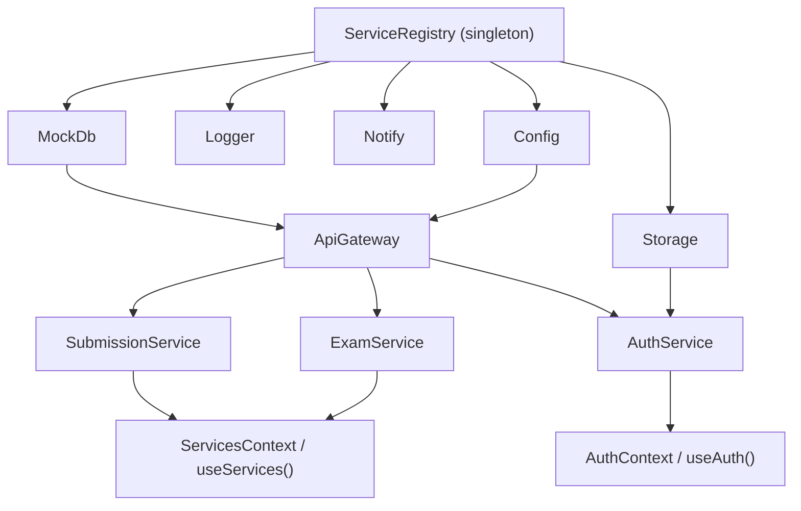
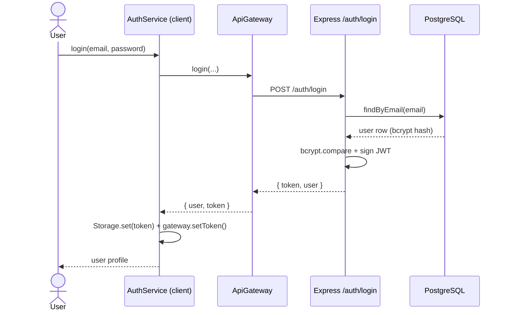
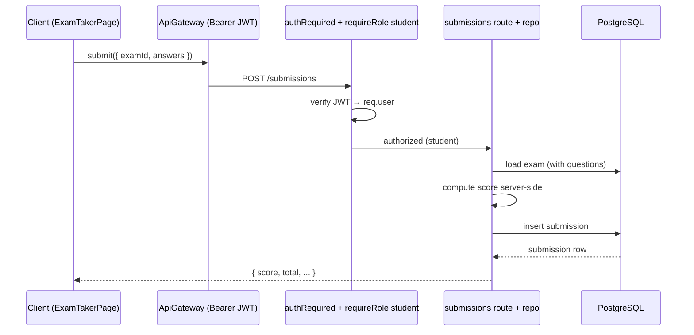
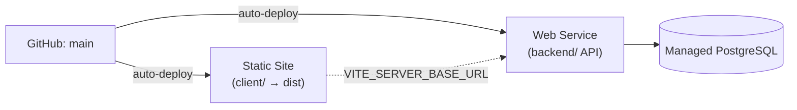

# Architecture

ExamApp is a client–server application. The **client** (`client/`) is a React SPA that can run standalone against an in-browser mock database or talk to the **server** (`backend/`), an Express API backed by PostgreSQL.

## System overview

### Dual-mode data layer (the central design)

The client runs in one of two modes, chosen by `Config.dataMode` (`'mock'` | `'http'`):

- **mock** — fully offline; data lives in `localStorage` via `client/src/api/mockDb.js`.
- **http** — calls the Express API.

Every data operation goes through the single `client/src/api/ApiGateway.js`, which switches between MockDb and `fetch` internally, so **pages and services never know which mode is active**. The mode is set by the `VITE_DATA_MODE` env var (see `client/.env`) or at runtime via `localStorage.setItem('examapp::dataMode','http')`; the API base URL comes from `VITE_SERVER_BASE_URL` (default `http://localhost:4000`).

## Client service graph (dependency injection)

`client/src/services/ServiceRegistry.js` bootstraps a singleton graph in dependency order and injects every service through constructors — there are no module-level globals. React reaches the graph through `ServicesContext` (`useServices()`); auth state lives in `AuthContext` (`useAuth()`).

Domain logic lives in ES6 model classes (`client/src/models/`: `Exam`, `Question`, `User`, `Submission`) with methods like `Exam.publish()`, `Question.isValid()`, and `toJSON()` — not in components.

## Backend layering

Requests flow `routes/ → repositories/ → db.js (pg pool)`, with cross-cutting `middlewares/` and `auth/` helpers.

| Layer | Responsibility |
|-------|----------------|
| `routes/` (`auth`, `exams`, `submissions`, `users`) | Validate input, authorize, orchestrate |
| `middlewares/` (`authRequired`, `requireRole`, `errorHandler`) | Verify JWT → `req.user`; guard by role; normalize errors |
| `auth/` (`tokens.js`, `password.js`) | JWT sign/verify; bcrypt hash/compare |
| `repositories/` (`usersRepo`, `examsRepo`, `submissionsRepo`) | **All SQL** — the only place queries live |
| `db.js` | `pg` connection pool + `ping()` |

Invariants worth preserving:

- **Repositories return the client's shape** — columns are aliased to camelCase (`created_by → createdBy`) and `TIMESTAMPTZ` is converted to epoch-ms numbers.
- **The server is authoritative** — `createdBy` / `studentId` come from the JWT (never the request body), exam scores are computed server-side, and passwords are stripped before responding.
- **Validation is intentionally duplicated** on client (`Question.isValid`) and server (`isValidQuestion`) because the client can be bypassed.

## Auth token flow

On reload, `AuthService` rehydrates the stored token onto the gateway, so `ApiGateway` keeps attaching `Authorization: Bearer <token>`. In mock mode there is no token (role gating is client-side only).

## Request lifecycle — submitting an exam

## Database connection modes

`backend/src/db.js` picks a connection at startup:

- **`DATABASE_URL` wins** (managed / cloud PostgreSQL such as Render) — a single connection string with TLS.
- Otherwise, discrete **`PG_*`** vars (local Docker / native).

`server.js` loads `import 'dotenv/config'` first, then **pings the DB on boot and exits** with a clear message if it can't connect — so the API requires a reachable PostgreSQL in http mode.

## Deployment

Deployed on **Render**, both services auto-deploying from `main`:

- **Static site** — rootDir `client/`, build `npm install; npm run build`, publishes `dist`, with an SPA rewrite `/* → /index.html`. `VITE_*` env is baked in at build time.
- **Web service** — rootDir `backend/`, `npm install` / `npm start`; reads `DATABASE_URL`, `JWT_SECRET`, `CORS_ORIGIN` from Render env vars; connects to the managed Postgres over its internal URL.
