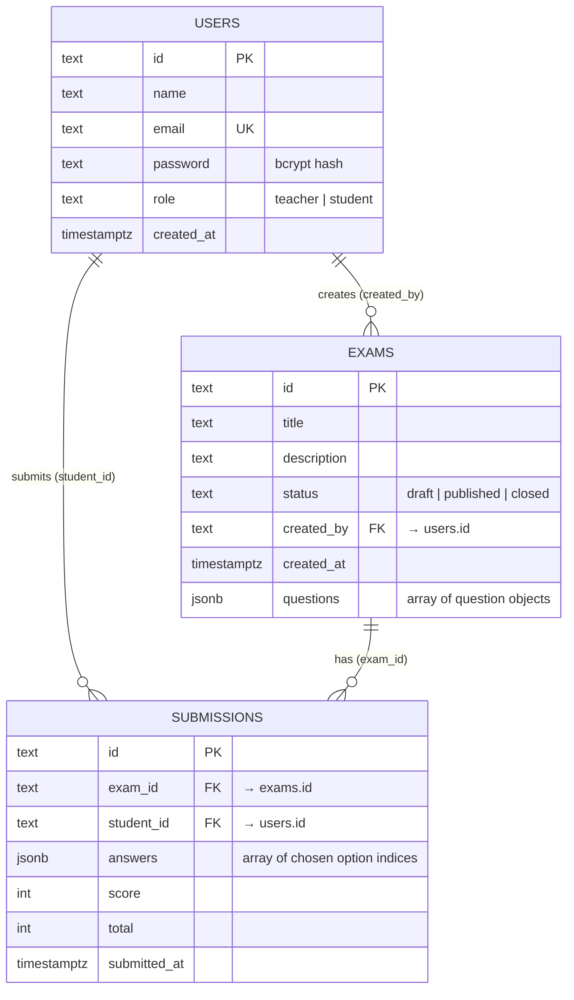

# Database

PostgreSQL with a hybrid **relational + JSONB** design (`backend/db/01_schema.sql`): entity metadata lives in columns for fast, indexable queries, while an exam's questions and a submission's answers are stored as JSONB — avoiding separate `questions` / `answers` tables while still being queryable in SQL (`jsonb_array_elements`).

## Entity–relationship diagram



## Tables

### `users`
Registered teachers and students.

| Column | Type | Notes |
|--------|------|-------|
| `id` | TEXT | PK, app-generated (`backend/src/ids.js`) |
| `name` | TEXT | |
| `email` | TEXT | `UNIQUE` |
| `password` | TEXT | bcrypt hash (never plaintext) |
| `role` | TEXT | `CHECK (role IN ('teacher','student'))` |
| `created_at` | TIMESTAMPTZ | default `NOW()` |

### `exams`
Exam metadata in columns; the questions live in one JSONB column.

| Column | Type | Notes |
|--------|------|-------|
| `id` | TEXT | PK |
| `title` | TEXT | |
| `description` | TEXT | default `''` |
| `status` | TEXT | `CHECK (status IN ('draft','published','closed'))` |
| `created_by` | TEXT | FK → `users(id)` `ON DELETE CASCADE` |
| `created_at` | TIMESTAMPTZ | default `NOW()` |
| `questions` | JSONB | default `'[]'` — see shape below |

`questions` shape (one object per question):

```json
{
  "id": "q_js_1",
  "text": "What is a closure?",
  "options": ["...", "...", "...", "..."],
  "correctAnswer": 0
}
```

Only single-answer multiple choice is supported: `options` holds 2–6 strings and `correctAnswer` is the index of the correct one.

### `submissions`
One row per student attempt; the chosen answers live in one JSONB column and the score is computed server-side at submit time.

| Column | Type | Notes |
|--------|------|-------|
| `id` | TEXT | PK |
| `exam_id` | TEXT | FK → `exams(id)` `ON DELETE CASCADE` |
| `student_id` | TEXT | FK → `users(id)` `ON DELETE CASCADE` |
| `answers` | JSONB | array of chosen option indices, aligned by question position |
| `score` | INT | correct answers, computed on the server |
| `total` | INT | number of questions |
| `submitted_at` | TIMESTAMPTZ | default `NOW()` |

## Constraints & indexes

- **Keys:** TEXT primary keys generated by the app (not `SERIAL`); `UNIQUE(email)`.
- **Referential integrity:** all foreign keys cascade on delete.
- **Checks:** `role` and `status` are constrained to their allowed values.
- **Indexes:** a **GIN** index on `exams.questions` (search inside the JSONB) and B-tree indexes on `submissions(exam_id)` and `submissions(student_id)`.

## Seeding & connection

- Schema + seed: `backend/db/01_schema.sql` and `02_seed.sql`. Locally, the Docker image runs them automatically on first start; on a managed database (Render) they are applied once by hand.
- Demo data: users `teacher@demo.test` / `student@demo.test` (bcrypt-hashed) plus two sample exams.
- Connection: `DATABASE_URL` (managed PG, TLS) takes precedence; otherwise discrete `PG_*` vars for local development. See [Architecture → connection modes](architecture.md#database-connection-modes).

> **Repository contract:** queries alias snake_case columns to camelCase (`created_by → createdBy`) and convert `TIMESTAMPTZ` to epoch-ms numbers so the API returns exactly the shape the client expects. Match this in any new query.
