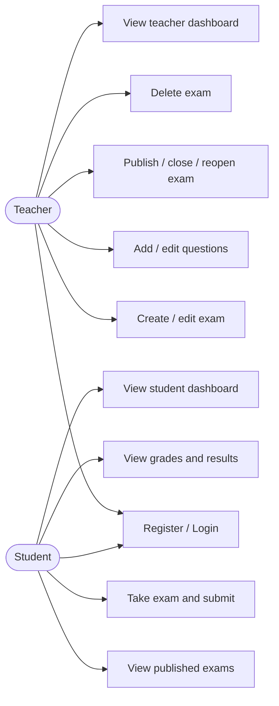
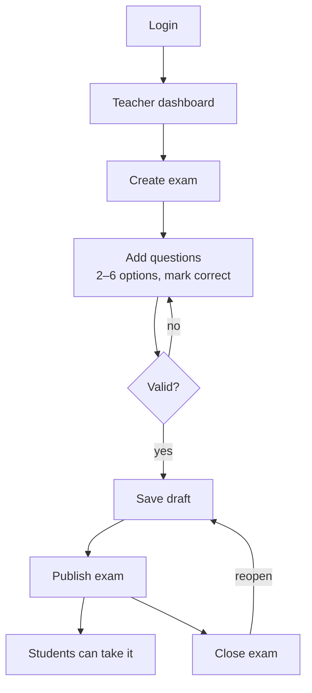
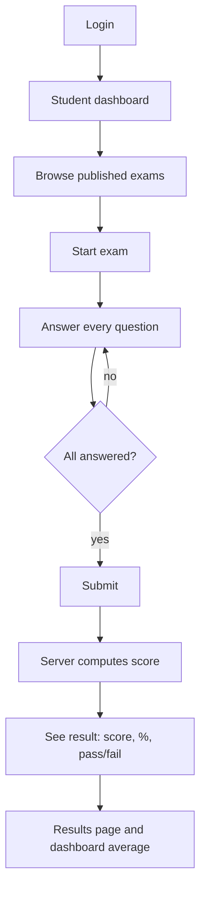

# Use cases

Two actors: **Teacher** and **Student**. Both authenticate; authorization (who may do what) is enforced on the server via role + ownership checks.

## Use-case diagram

## Teacher flow

A teacher can only edit, publish, or delete **exams they own** — the server rejects actions on another teacher's exam (403).

## Student flow

Grading is **automatic and server-side**: on submit, the API compares each answer to the exam's `correctAnswer` and stores `score` / `total`. Students see published exams only, and can retake a published exam.

## Implemented vs. planned

| Use case | Status |
|----------|--------|
| Create / edit / publish / close / delete exams | ✅ Implemented |
| Single-answer multiple-choice questions | ✅ Implemented |
| Take exam, submit, server auto-grade | ✅ Implemented |
| View grades + dashboards | ✅ Implemented |
| Multiple question types (true/false, open text…) | ⬜ Planned |
| Teacher reviews submissions / manual grading | ⬜ Planned |
| Separate "publish results" step | ⬜ Planned (results are shown immediately) |
| Per-question feedback | ⬜ Planned |
| Admin role & management tools | ⬜ Planned |

See the [root README roadmap](../README.md#roadmap) for the broader direction.
